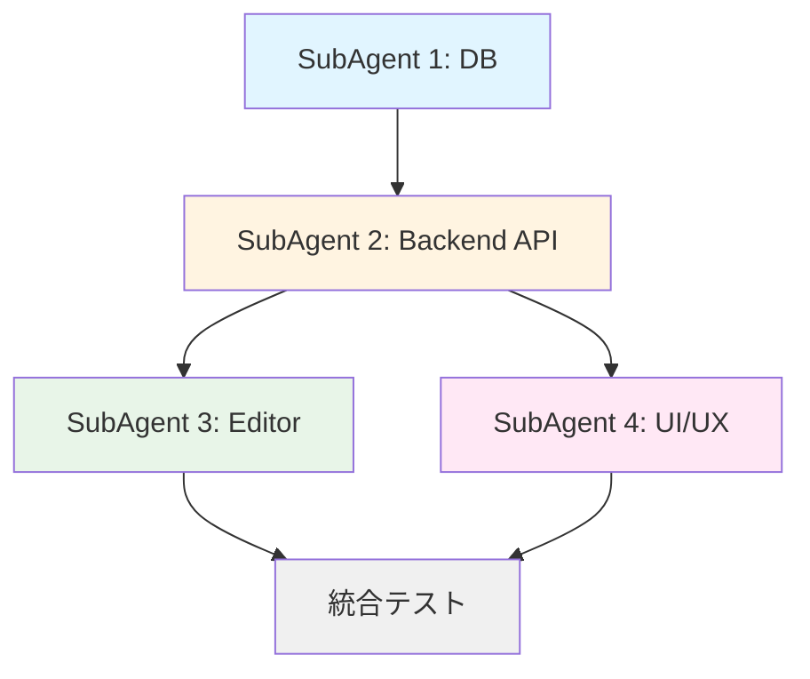

# Phase 3 実装ロードマップ - ノート間リンク & 知識化機能

## エグゼクティブサマリー

Phase 2完了時点で、基本的なメモ機能、タグ管理、フォルダ構造、高度検索、エクスポート/インポート機能が実装済みです。Phase 3では、メモを「孤立した情報」から「つながりを持つ知識ベース」へ進化させます。

### 目標

- **[[ノート名]]記法によるノート間リンク**
- **バックリンク自動検出と表示**
- **関連ノート自動提案**

これらにより、Zettelkasten的な知識体系構築を可能にします。

---

## 1. Phase 3 詳細機能仕様

### 1.1 機能1: [[ノート名]]記法 - ノート間リンク

#### 概要
Obsidian/Notion形式の`[[ノート名]]`記法でノート間のリンクを作成します。

#### 詳細仕様

**記法パターン**
```markdown
[[完全なノート名]]              → 通常リンク
[[ノート名|表示テキスト]]       → エイリアス付きリンク
[[フォルダ名/ノート名]]         → フォルダパス付きリンク
```

**動作仕様**
- リンク入力時のオートコンプリート（`[[`入力でドロップダウン表示）
- リンク先ノートの存在チェック
  - 存在する場合: 青色リンク、クリックで遷移
  - 存在しない場合: 赤色リンク、クリックで新規ノート作成
- ホバープレビュー（マウスオーバーで内容プレビュー表示）
- リンククリック時の遷移

**技術実装**
- TipTap カスタム拡張（NoteLink Extension）
- 正規表現パターン: `/\[\[([^\]|]+)(?:\|([^\]]+))?\]\]/g`
- リンク解析エンジン（コンテンツ保存時にリンク抽出）
- データベース更新（NoteLink中間テーブル）

#### 依存関係
- **DB**: NoteLink テーブル追加
- **Backend**: リンク解析API
- **Frontend**: TipTap拡張、オートコンプリートUI

---

### 1.2 機能2: バックリンク表示

#### 概要
現在のノートを参照している他のノート一覧を表示します。

#### 詳細仕様

**表示内容**
- バックリンク元ノートのタイトル
- リンクが含まれるコンテキスト（前後50文字）
- 最終更新日時
- バックリンク数カウント

**表示位置**
- ノートエディタ下部に「バックリンク」パネル
- 折りたたみ可能
- 0件の場合は「このノートへのリンクはありません」表示

**動作**
- バックリンククリックで該当ノートへ遷移
- リアルタイム更新（他ノートでリンク追加時に自動反映）

#### 技術実装
- GET `/api/notes/:id/backlinks` エンドポイント
- Prisma クエリで双方向検索
- フロントエンド: BacklinkPanel コンポーネント

#### 依存関係
- **機能1完了が前提**（NoteLink テーブル）
- **Backend**: バックリンク取得API
- **Frontend**: BacklinkPanel コンポーネント

---

### 1.3 機能3: 関連ノート自動提案

#### 概要
現在のノートと関連性の高いノートを自動的に提案します。

#### 詳細仕様

**関連性判定基準（優先度順）**
1. **リンク関係**: 相互リンク、2ホップリンク
2. **共通タグ**: タグ一致数でスコアリング
3. **キーワード類似**: タイトル・コンテンツの共通単語
4. **同一フォルダ**: 最近更新されたノート

**スコアリング方式**
```typescript
score =
  (mutual_links × 10) +
  (shared_tags × 5) +
  (keyword_similarity × 3) +
  (same_folder × 1)
```

**表示仕様**
- 上位5件を表示
- サイドバーまたはノート下部
- スコア順にソート
- 「関連度」を視覚的に表示（星マーク等）

**除外条件**
- 自分自身
- アーカイブ済みノート
- 削除済みノート

#### 技術実装
- GET `/api/notes/:id/related` エンドポイント
- 簡易TF-IDFまたはキーワードマッチング
- キャッシュ機構（1時間）

#### 依存関係
- **機能1, 2完了推奨**（リンクデータ活用）
- **Backend**: 関連度計算ロジック
- **Frontend**: RelatedNotesPanel コンポーネント

---

## 2. タスク分割案（4並列SubAgent）

### Phase 3の並列開発戦略

Phase 3の機能は以下の4つのSubAgentで並列開発します。ファイル競合を避けるため、担当ファイルを明確に分離します。

---

### SubAgent 1: データベース & スキーマ

**担当範囲**
- Prismaスキーマ拡張
- マイグレーション作成
- シードデータ追加

**具体的タスク**
1. `prisma/schema.prisma` に NoteLink モデル追加
   ```prisma
   model NoteLink {
     id           String   @id @default(uuid())
     sourceNoteId String
     targetNoteId String
     anchorText   String?  // [[ノート名|表示テキスト]] の「表示テキスト」部分
     createdAt    DateTime @default(now())

     sourceNote   Note     @relation("OutgoingLinks", fields: [sourceNoteId], references: [id], onDelete: Cascade)
     targetNote   Note     @relation("IncomingLinks", fields: [targetNoteId], references: [id], onDelete: Cascade)

     @@unique([sourceNoteId, targetNoteId])
     @@index([sourceNoteId])
     @@index([targetNoteId])
   }
   ```

2. Note モデルに逆参照追加
   ```prisma
   model Note {
     // ... 既存フィールド
     outgoingLinks NoteLink[] @relation("OutgoingLinks")
     incomingLinks NoteLink[] @relation("IncomingLinks")
   }
   ```

3. マイグレーション実行
   ```bash
   npx prisma db push
   npx prisma generate
   ```

4. テストデータ作成（`prisma/seed-links.ts`）

**完了条件**
- [ ] NoteLink テーブル作成完了
- [ ] Prisma Client 再生成完了
- [ ] テストデータ投入完了
- [ ] DB接続確認テスト通過

**推定工数**: 2-3時間

---

### SubAgent 2: バックエンド API

**担当範囲**
- リンク解析ロジック
- APIエンドポイント実装
- ビジネスロジック

**具体的タスク**

1. リンク解析ユーティリティ作成（`src/backend/utils/linkParser.ts`）
   ```typescript
   export interface ParsedLink {
     noteTitle: string;
     anchorText?: string;
     folderPath?: string;
   }

   export function extractLinks(content: string): ParsedLink[] {
     const LINK_PATTERN = /\[\[([^\]|]+)(?:\|([^\]]+))?\]\]/g;
     // ... パース処理
   }

   export async function syncNoteLinks(noteId: string, content: string) {
     // 既存リンク削除 → 新規リンク作成
   }
   ```

2. リンク関連API追加（`src/backend/api/links.ts`）
   ```typescript
   GET  /api/notes/:id/links        // 発リンク一覧
   GET  /api/notes/:id/backlinks    // 被リンク一覧
   GET  /api/notes/:id/related      // 関連ノート
   POST /api/notes/:id/links/sync   // リンク同期（手動トリガー用）
   ```

3. ノートAPI更新（`src/backend/api/notes.ts`）
   - PUT `/api/notes/:id` にリンク自動同期処理追加
   - ノート保存時に `syncNoteLinks()` 呼び出し

4. 関連ノート計算ロジック（`src/backend/services/relatedNotesService.ts`）
   ```typescript
   export async function calculateRelatedNotes(noteId: string, limit = 5) {
     // スコアリング処理
   }
   ```

**完了条件**
- [ ] リンク解析ロジック実装完了
- [ ] 4つのAPIエンドポイント実装完了
- [ ] ノート保存時の自動リンク同期動作確認
- [ ] ユニットテスト作成（`tests/backend/links.test.ts`）

**推定工数**: 6-8時間

---

### SubAgent 3: フロントエンド - エディタ拡張

**担当範囲**
- TipTap拡張機能
- エディタ機能強化
- オートコンプリート

**具体的タスク**

1. TipTap NoteLink 拡張作成（`src/frontend/extensions/NoteLink.ts`）
   ```typescript
   import { Node, mergeAttributes } from '@tiptap/core';
   import { Plugin, PluginKey } from '@tiptap/pm/state';

   export const NoteLink = Node.create({
     name: 'noteLink',
     group: 'inline',
     inline: true,
     atom: true,

     addAttributes() {
       return {
         noteId: { default: null },
         noteTitle: { default: '' },
         exists: { default: true },
       }
     },

     parseHTML() {
       return [{ tag: 'a[data-note-link]' }]
     },

     renderHTML({ node, HTMLAttributes }) {
       const className = node.attrs.exists
         ? 'note-link note-link-exists'
         : 'note-link note-link-missing';
       return ['a', mergeAttributes(HTMLAttributes, {
         class: className,
         'data-note-link': '',
         'data-note-id': node.attrs.noteId,
       }), node.attrs.noteTitle];
     },

     addProseMirrorPlugins() {
       return [
         new Plugin({
           key: new PluginKey('noteLinkParser'),
           // [[ パース処理
         })
       ]
     }
   });
   ```

2. オートコンプリート機能（`src/frontend/components/Editor/NoteLinkSuggestion.tsx`）
   - `[[` 入力検知
   - ノート一覧取得
   - ドロップダウン表示
   - 選択時の挿入処理

3. エディタhook更新（`src/frontend/hooks/useEditor.ts`）
   - NoteLink拡張追加
   - リンク解析処理追加

4. ホバープレビュー（`src/frontend/components/Editor/NoteLinkPreview.tsx`）
   - マウスオーバー検知
   - プレビューポップアップ表示

**完了条件**
- [ ] TipTap拡張実装完了
- [ ] [[ オートコンプリート動作確認
- [ ] リンククリック遷移動作確認
- [ ] ホバープレビュー動作確認
- [ ] 赤リンク/青リンク表示確認

**推定工数**: 8-10時間

---

### SubAgent 4: フロントエンド - UI/UXコンポーネント

**担当範囲**
- バックリンクパネル
- 関連ノートパネル
- スタイリング

**具体的タスク**

1. バックリンクパネル（`src/frontend/components/Links/BacklinkPanel.tsx`）
   ```typescript
   interface Backlink {
     noteId: string;
     noteTitle: string;
     context: string;  // リンク前後のテキスト
     updatedAt: Date;
   }

   export function BacklinkPanel({ noteId }: { noteId: string }) {
     const [backlinks, setBacklinks] = useState<Backlink[]>([]);
     // API呼び出し、表示処理
   }
   ```

2. 関連ノートパネル（`src/frontend/components/Links/RelatedNotesPanel.tsx`）
   ```typescript
   interface RelatedNote {
     noteId: string;
     noteTitle: string;
     score: number;
     reason: string;  // "3個の共通タグ" 等
   }

   export function RelatedNotesPanel({ noteId }: { noteId: string }) {
     // 関連ノート表示
   }
   ```

3. レイアウト統合（`src/frontend/components/Layout/MainLayout.tsx` 修正）
   - サイドバーに関連ノートパネル追加
   - エディタ下部にバックリンクパネル追加

4. スタイリング（Tailwind CSS）
   - リンクのホバー効果
   - 赤リンク/青リンクの色
   - パネルのデザイン

**完了条件**
- [ ] バックリンクパネル実装完了
- [ ] 関連ノートパネル実装完了
- [ ] レイアウト統合完了
- [ ] レスポンシブデザイン確認
- [ ] UI/UXテスト完了

**推定工数**: 6-8時間

---

## 3. 実装順序と依存関係



### クリティカルパス

1. **Day 1**: SubAgent 1（DB） → **2-3時間**
2. **Day 2-3**: SubAgent 2（Backend） → **6-8時間**
3. **Day 4-5**: SubAgent 3（Editor） + SubAgent 4（UI） **並列実行** → **8-10時間**
4. **Day 6**: 統合テスト、バグ修正 → **4-6時間**

**総推定工数**: 20-27時間（実作業3-5日）

---

## 4. ファイル競合回避計画

### 担当ファイル一覧

| SubAgent | 新規作成ファイル | 編集ファイル | 競合リスク |
|----------|------------------|--------------|------------|
| SubAgent 1 | `prisma/seed-links.ts` | `prisma/schema.prisma` | 低（単独作業） |
| SubAgent 2 | `src/backend/api/links.ts`<br>`src/backend/utils/linkParser.ts`<br>`src/backend/services/relatedNotesService.ts` | `src/backend/api/notes.ts`（リンク同期処理追加） | 低 |
| SubAgent 3 | `src/frontend/extensions/NoteLink.ts`<br>`src/frontend/components/Editor/NoteLinkSuggestion.tsx`<br>`src/frontend/components/Editor/NoteLinkPreview.tsx` | `src/frontend/hooks/useEditor.ts` | 中 |
| SubAgent 4 | `src/frontend/components/Links/BacklinkPanel.tsx`<br>`src/frontend/components/Links/RelatedNotesPanel.tsx` | `src/frontend/components/Layout/MainLayout.tsx` | 中 |

### 競合防止策

1. **SubAgent 1は最初に実行**（他の前提条件）
2. **SubAgent 2は単独実行**（SubAgent 1完了後）
3. **SubAgent 3, 4は並列実行可能**（編集ファイルが異なる）
4. **MainLayout.tsx は最後に統合**（SubAgent 4が担当）

### Hooks自動ロック

- `.claude/hooks/pre-tool-use` でファイルロック
- 同一ファイル編集時はエラー通知
- ロックタイムアウト: 30秒

---

## 5. テスト戦略

### 5.1 ユニットテスト

**バックエンド**
- `tests/backend/links.test.ts`: リンク解析ロジック
- `tests/backend/linkParser.test.ts`: パース処理
- `tests/backend/relatedNotes.test.ts`: 関連度計算

**フロントエンド**
- `src/frontend/extensions/__tests__/NoteLink.test.ts`: TipTap拡張
- `src/frontend/components/Links/__tests__/BacklinkPanel.test.tsx`: コンポーネント

### 5.2 統合テスト

```typescript
// tests/integration/noteLinks.test.ts
describe('Note Links Integration', () => {
  test('[[ノート名]] 入力でリンクが作成される', async () => {
    // ノート作成
    // [[リンク]] 入力
    // リンクテーブル確認
  });

  test('バックリンクが正しく表示される', async () => {
    // ノートA作成
    // ノートBでAへのリンク作成
    // ノートAのバックリンク確認
  });

  test('関連ノートが提案される', async () => {
    // 共通タグを持つノート作成
    // 関連ノートAPI呼び出し
    // スコア確認
  });
});
```

### 5.3 E2Eテスト（Playwright）

```typescript
// tests/e2e/noteLinks.spec.ts
test('ノート間リンク作成と遷移', async ({ page }) => {
  await page.goto('/');
  await page.click('[data-testid="new-note"]');
  await page.fill('[data-testid="editor"]', '[[テストノート]]');
  await page.click('a[data-note-link]');
  // 遷移確認
});
```

### テスト完了条件

- [ ] ユニットテストカバレッジ 80%以上
- [ ] 統合テスト全パス
- [ ] E2Eテスト主要フロー全パス
- [ ] 手動テスト（ユーザビリティ確認）

---

## 6. リスク評価と対策

### 高リスク項目

| リスク | 影響 | 対策 |
|--------|------|------|
| TipTap拡張の複雑性 | スケジュール遅延 | 早期プロトタイプ作成、段階的実装 |
| リンク解析のパフォーマンス | UX悪化 | 非同期処理、キャッシュ、インデックス最適化 |
| 既存ノートへのリンク付与 | データ不整合 | マイグレーションスクリプト作成 |

### 中リスク項目

| リスク | 影響 | 対策 |
|--------|------|------|
| フォルダパス対応の複雑性 | 機能遅延 | Phase 3.5に延期可能 |
| 循環リンクの処理 | 無限ループ | 深さ制限、訪問済みチェック |

### 低リスク項目

| リスク | 影響 | 対策 |
|--------|------|------|
| UIデザインの微調整 | 時間超過 | 最低限のデザインで先行リリース |

---

## 7. マイルストーン

### Sprint 1: 基盤構築（Day 1-2）

- [ ] DBスキーマ作成
- [ ] リンク解析ロジック実装
- [ ] 基本APIエンドポイント実装

**成果物**: リンクデータがDBに保存される状態

### Sprint 2: エディタ統合（Day 3-4）

- [ ] TipTap拡張実装
- [ ] オートコンプリート実装
- [ ] リンククリック遷移実装

**成果物**: エディタで [[]] リンクが機能する状態

### Sprint 3: バックリンク & 関連ノート（Day 5-6）

- [ ] バックリンクパネル実装
- [ ] 関連ノート計算実装
- [ ] UI統合

**成果物**: バックリンクと関連ノートが表示される状態

### Sprint 4: テスト & 品質改善（Day 7）

- [ ] テスト作成
- [ ] バグ修正
- [ ] ドキュメント更新

**成果物**: Phase 3完了、リリース可能状態

---

## 8. Phase 4以降の展望

### Phase 4: AI連携（推定工数: 30-40時間）

#### 主要機能

1. **ベクトル埋め込み**
   - ノート内容の自動ベクトル化
   - sqlite-vss または LanceDB 導入
   - バックグラウンド処理で既存ノートを順次ベクトル化

2. **セマンティック検索**
   - 意味ベースの類似検索
   - キーワード検索との組み合わせ
   - 検索結果の関連度表示

3. **AI要約**
   - 長文ノートの自動要約
   - Ollama + Llama 3.2（ローカル）優先
   - Claude API（オプション）

4. **質問応答**
   - ナレッジベース全体へのQ&A
   - RAG（Retrieval-Augmented Generation）
   - 回答根拠ノートの提示

#### 技術検討

**ベクトルDB選定基準**
- **sqlite-vss**: SQLite拡張、既存DBと統合しやすい
- **LanceDB**: Node.js対応、高速、ローカル完結
- **Chroma**: Python必要、多機能だが重い

**推奨**: LanceDB（TypeScript対応、パフォーマンス良好）

**埋め込みモデル**
- **ローカル**: Ollama + nomic-embed-text（プライバシー重視）
- **クラウド**: OpenAI text-embedding-3-small（高精度）

#### データモデル追加

```prisma
model NoteEmbedding {
  id        String   @id @default(uuid())
  noteId    String   @unique
  note      Note     @relation(fields: [noteId], references: [id], onDelete: Cascade)
  vector    Bytes    // ベクトルのバイナリ表現
  model     String   // 使用した埋め込みモデル名
  updatedAt DateTime @updatedAt

  @@index([noteId])
}

model AIInteraction {
  id          String   @id @default(uuid())
  type        String   // 'summarize', 'qa', 'suggest-tags'
  noteId      String?
  note        Note?    @relation(fields: [noteId], references: [id])
  input       String
  output      String
  model       String
  createdAt   DateTime @default(now())

  @@index([noteId])
  @@index([type])
}
```

#### API設計

```
# セマンティック検索
GET /api/search/semantic?q=クエリ&limit=10

# AI機能
POST /api/ai/summarize
  Body: { noteId: string }
  Response: { summary: string }

POST /api/ai/suggest-tags
  Body: { noteId: string }
  Response: { tags: string[] }

POST /api/ai/qa
  Body: { question: string }
  Response: { answer: string, sourceNotes: string[] }

POST /api/ai/proofread
  Body: { noteId: string, content: string }
  Response: { suggestions: Suggestion[] }
```

#### SubAgent分割案（Phase 4）

1. **SubAgent 1**: ベクトルDB統合、埋め込みロジック
2. **SubAgent 2**: セマンティック検索API、RAG実装
3. **SubAgent 3**: AI機能API（要約、Q&A、タグ提案）
4. **SubAgent 4**: フロントエンドUI、設定画面

---

### Phase 5以降: 将来構想

#### Phase 5: モバイル対応
- PWA化
- レスポンシブUI強化
- オフライン同期

#### Phase 6: 共同編集
- WebSocket統合
- リアルタイム共同編集
- コメント機能

#### Phase 7: プラグインシステム
- カスタムTipTap拡張
- APIプラグイン
- テーマシステム

---

## 9. GitHub MCP 使用計画

### Issue/PRテンプレート作成

#### Issue Template: Phase 3 Feature

```markdown
## 機能概要
[機能の簡潔な説明]

## 仕様
- [ ] 詳細仕様1
- [ ] 詳細仕様2

## 技術実装
- データベース変更: Yes/No
- API変更: Yes/No
- フロントエンド変更: Yes/No

## 完了条件
- [ ] 実装完了
- [ ] テスト作成
- [ ] ドキュメント更新

## 関連Issue
#xxx

---
Phase: Phase 3
Priority: High/Medium/Low
Estimated Hours: X
```

#### PR Template: Phase 3

```markdown
## 変更内容
[変更の簡潔な説明]

## 関連Issue
Closes #xxx

## 変更の種類
- [ ] 新機能
- [ ] バグ修正
- [ ] リファクタリング
- [ ] ドキュメント

## テスト
- [ ] ユニットテスト追加
- [ ] 統合テスト追加
- [ ] 手動テスト完了

## チェックリスト
- [ ] コードレビュー済み
- [ ] TypeScriptエラーなし
- [ ] Lintエラーなし
- [ ] テスト全パス
- [ ] ドキュメント更新済み

---
Phase: Phase 3
SubAgent: 1/2/3/4
```

### マイルストーン設定

```bash
# GitHub CLIでマイルストーン作成
gh api repos/:owner/:repo/milestones -f title="Phase 3: Knowledge Linking" -f description="ノート間リンク、バックリンク、関連ノート機能" -f due_on="2025-12-31T23:59:59Z"
```

### Issueラベル

- `phase:3` - Phase 3関連
- `priority:high` - 優先度高
- `priority:medium` - 優先度中
- `priority:low` - 優先度低
- `type:feature` - 新機能
- `type:bug` - バグ
- `subagent:1` - SubAgent 1担当
- `subagent:2` - SubAgent 2担当
- `subagent:3` - SubAgent 3担当
- `subagent:4` - SubAgent 4担当

---

## 10. Memory MCP 使用計画

### 記憶すべき設計方針

#### Phase 3設計方針

```
Key: phase3_design_principles
Value: {
  "link_format": "[[ノート名]] Obsidian互換形式",
  "link_resolution": "タイトル完全一致優先、曖昧マッチング二次",
  "backlink_context": "前後50文字表示",
  "related_notes_algorithm": "リンク関係 > 共通タグ > キーワード類似",
  "performance_target": "1000ノートで1秒以内のリンク解析"
}
```

#### 技術選定理由

```
Key: phase3_tech_decisions
Value: {
  "tiptap_extension": "カスタム拡張で[[]]記法を独自実装",
  "link_storage": "中間テーブルで双方向リンク管理",
  "related_notes_cache": "1時間キャッシュでパフォーマンス確保",
  "autocomplete_threshold": "2文字入力で候補表示"
}
```

#### プロジェクト目標との整合性

```
Key: project_goals
Value: {
  "goal1": "思考を邪魔しないUI/UX - オートコンプリートで素早くリンク作成",
  "goal2": "書いたあとに探せる - バックリンクと関連ノートで再発見",
  "goal3": "小さく始め、積み上げられる - 段階的にAI連携へ",
  "goal4": "データは手元にある - ローカルDB、エクスポート可能",
  "goal5": "将来のAI連携を阻害しない - リンクデータがベクトル検索の基盤に"
}
```

---

## 11. 実装開始コマンド例

### SubAgent起動テンプレート

```
以下のタスクを4つのSubAgentで並列実行してください:

---

SubAgent 1 (general-purpose): Phase 3 データベーススキーマ実装

タスク:
1. prisma/schema.prisma に NoteLink モデル追加
2. Note モデルに outgoingLinks/incomingLinks 追加
3. npx prisma db push でスキーマ反映
4. npx prisma generate でクライアント再生成
5. prisma/seed-links.ts でテストデータ作成
6. npm run db:seed 実行

完了条件:
- NoteLink テーブルがDBに存在
- Prisma Client で NoteLink が使用可能
- テストデータが投入済み

---

SubAgent 2 (general-purpose): Phase 3 バックエンドAPI実装

タスク:
1. src/backend/utils/linkParser.ts 作成（リンク解析ロジック）
2. src/backend/services/relatedNotesService.ts 作成（関連ノート計算）
3. src/backend/api/links.ts 作成（4つのエンドポイント）
4. src/backend/api/notes.ts のPUT /:id にリンク同期処理追加
5. tests/backend/links.test.ts 作成

完了条件:
- GET /api/notes/:id/links が動作
- GET /api/notes/:id/backlinks が動作
- GET /api/notes/:id/related が動作
- ノート保存時にリンクが自動同期される
- テスト全パス

---

SubAgent 3 (general-purpose): Phase 3 TipTapエディタ拡張実装

タスク:
1. src/frontend/extensions/NoteLink.ts 作成（TipTap拡張）
2. src/frontend/components/Editor/NoteLinkSuggestion.tsx 作成（オートコンプリート）
3. src/frontend/components/Editor/NoteLinkPreview.tsx 作成（ホバープレビュー）
4. src/frontend/hooks/useEditor.ts に NoteLink 拡張追加
5. Tailwind CSS でリンクスタイル追加

完了条件:
- [[ 入力でオートコンプリート表示
- ノート選択でリンク挿入
- リンククリックで遷移
- ホバーでプレビュー表示
- 赤リンク/青リンクの色分け

---

SubAgent 4 (general-purpose): Phase 3 UI/UXコンポーネント実装

タスク:
1. src/frontend/components/Links/BacklinkPanel.tsx 作成
2. src/frontend/components/Links/RelatedNotesPanel.tsx 作成
3. src/frontend/components/Layout/MainLayout.tsx にパネル統合
4. Tailwind CSS でパネルデザイン
5. レスポンシブ対応

完了条件:
- バックリンクパネルが表示される
- 関連ノートパネルが表示される
- サイドバーとエディタ下部に適切に配置
- モバイルでも動作確認

---

各SubAgentは独立したファイルを担当し、競合を避けてください。
SubAgent 1 → SubAgent 2 の順に実行し、SubAgent 3/4 は並列実行可能です。
完了後、統合テストを実行してください。
```

---

## 12. 品質基準（Definition of Done）

### Phase 3完了条件

- [ ] **機能完成度**
  - [ ] [[ノート名]] でリンク作成可能
  - [ ] オートコンプリートが動作
  - [ ] リンククリックで遷移
  - [ ] バックリンクが表示される
  - [ ] 関連ノートが提案される
  - [ ] 赤リンク/青リンクの判定

- [ ] **パフォーマンス**
  - [ ] 1000ノートでリンク解析1秒以内
  - [ ] オートコンプリート200ms以内
  - [ ] バックリンク取得500ms以内

- [ ] **テスト**
  - [ ] ユニットテストカバレッジ80%以上
  - [ ] 統合テスト全パス
  - [ ] E2Eテスト主要フロー全パス

- [ ] **コード品質**
  - [ ] TypeScriptエラーゼロ
  - [ ] ESLintエラーゼロ
  - [ ] コードレビュー完了

- [ ] **ドキュメント**
  - [ ] APIドキュメント更新
  - [ ] ユーザーガイド作成
  - [ ] README更新

- [ ] **デプロイ**
  - [ ] ローカル環境で動作確認
  - [ ] マイグレーション手順確認
  - [ ] ロールバック手順確認

---

## 13. 参考資料

### 参考実装

- **Obsidian**: [[]] 記法の先行実装
- **Notion**: ページ参照機能
- **Roam Research**: バックリンクの先駆者
- **Logseq**: オープンソース実装

### 技術ドキュメント

- [TipTap Extensions](https://tiptap.dev/docs/editor/extensions/custom-extensions)
- [Prisma Relations](https://www.prisma.io/docs/orm/prisma-schema/data-model/relations)
- [React Query](https://tanstack.com/query/latest) - キャッシュ管理
- [D3.js](https://d3js.org/) - グラフ可視化（Phase 3.5）

---

## 14. まとめ

Phase 3の実装により、本システムは単なる「メモアプリ」から「知識ベース」へと進化します。

### 期待される効果

1. **知識の発見**: バックリンクで忘れていたノートを再発見
2. **思考の連鎖**: リンクを辿って思考を展開
3. **構造化**: 孤立したメモが有機的につながる
4. **Phase 4への基盤**: リンクデータがAI連携の基盤となる

### 次のステップ

1. このロードマップをチームで確認
2. GitHub Issueを作成
3. SubAgent並列開発開始
4. 週次進捗確認

---

**作成日**: 2025-12-14
**Phase**: Phase 3 計画
**次回更新**: 実装開始時
