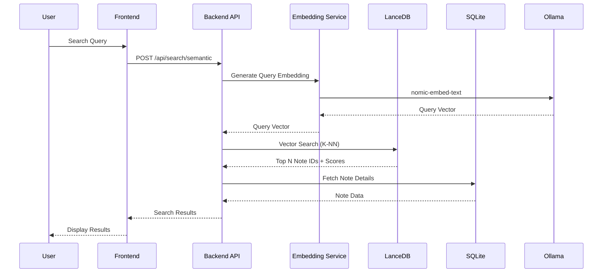
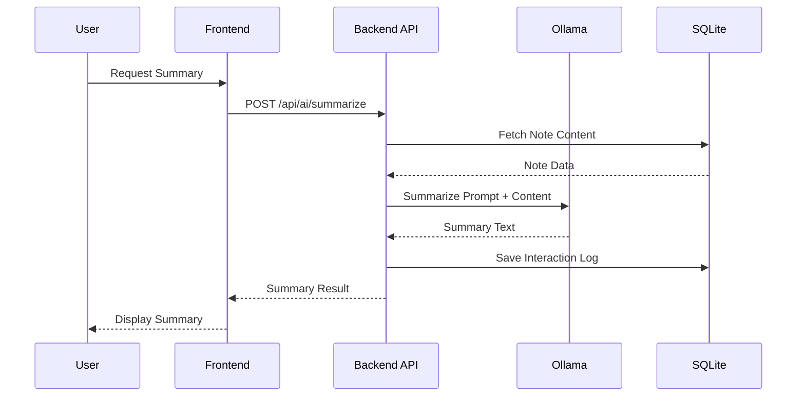
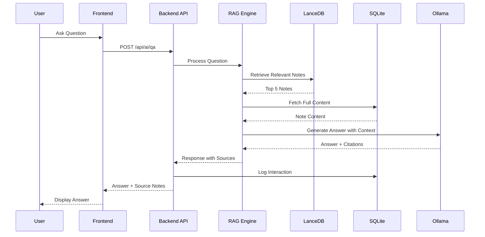
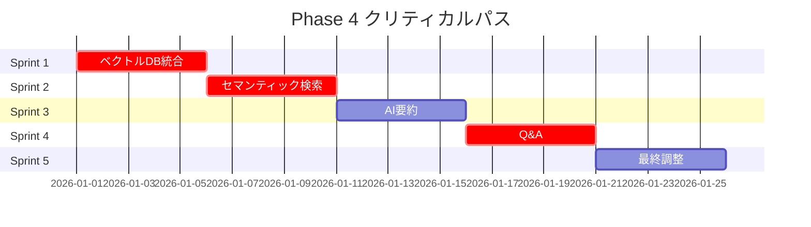

# Phase 4 実装ロードマップ - AI連携機能

## エグゼクティブサマリー

Phase 3完了時点で、ノート間リンク、バックリンク、関連ノート提案の基盤が構築されています。Phase 4では、AI技術を活用して「知識ベース」を「インテリジェント・ナレッジベース」へと進化させます。

### 目標

- **ベクトル埋め込みによるセマンティック検索**
- **類似ノート検索（意味ベース）**
- **AI要約機能**
- **RAG（Retrieval-Augmented Generation）による質問応答**
- **スマート機能（タグ提案、文章校正）**

これらにより、ローカルファースト・プライバシー重視のAI連携を実現します。

---

## 1. 全体アーキテクチャ設計

### 1.1 システム構成図

```
┌─────────────────────────────────────────────────────────────┐
│                     Frontend (React)                        │
│  ┌──────────┐  ┌──────────┐  ┌──────────┐  ┌──────────┐   │
│  │Semantic  │  │AI Summary│  │Q&A Chat  │  │Settings  │   │
│  │Search UI │  │Panel     │  │Interface │  │Panel     │   │
│  └──────────┘  └──────────┘  └──────────┘  └──────────┘   │
└────────────────────────┬────────────────────────────────────┘
                         │ REST API
┌────────────────────────▼────────────────────────────────────┐
│                   Backend (Express)                         │
│  ┌──────────────────────────────────────────────────────┐  │
│  │              AI Service Layer                        │  │
│  │  ┌──────────┐  ┌──────────┐  ┌──────────┐           │  │
│  │  │Embedding │  │RAG Engine│  │LLM Client│           │  │
│  │  │Service   │  │          │  │(Ollama)  │           │  │
│  │  └──────────┘  └──────────┘  └──────────┘           │  │
│  └──────────────────────────────────────────────────────┘  │
│  ┌──────────────────────────────────────────────────────┐  │
│  │              Business Logic                          │  │
│  │  ┌──────────┐  ┌──────────┐  ┌──────────┐           │  │
│  │  │Search    │  │Summarize │  │Tag       │           │  │
│  │  │Service   │  │Service   │  │Suggest   │           │  │
│  │  └──────────┘  └──────────┘  └──────────┘           │  │
│  └──────────────────────────────────────────────────────┘  │
└────────────────────────┬────────────────────────────────────┘
                         │
┌────────────────────────▼────────────────────────────────────┐
│                    Data Layer                               │
│  ┌─────────────┐  ┌─────────────┐  ┌─────────────┐        │
│  │  SQLite     │  │ LanceDB     │  │ Ollama      │        │
│  │  (Prisma)   │  │ (Vectors)   │  │ (Local LLM) │        │
│  │  - Notes    │  │ - Embeddings│  │ - Llama 3.2 │        │
│  │  - Tags     │  │ - Index     │  │ - nomic-emb │        │
│  │  - Links    │  │             │  │             │        │
│  └─────────────┘  └─────────────┘  └─────────────┘        │
└─────────────────────────────────────────────────────────────┘
```

### 1.2 データフロー図

#### セマンティック検索フロー



#### AI要約フロー



#### RAG Q&Aフロー



### 1.3 Phase 3との統合ポイント

| Phase 3機能 | Phase 4での活用 |
|-------------|-----------------|
| ノート間リンク | グラフ構造をRAGのコンテキストに活用 |
| バックリンク | 関連性スコアリングの補助情報 |
| 関連ノート（ルールベース） | セマンティック検索結果との統合 |
| タグシステム | タグ自動提案のトレーニングデータ |
| フォルダ構造 | 検索結果のフィルタリング |

---

## 2. データベーススキーマ詳細設計

### 2.1 新規テーブル定義

#### NoteEmbedding テーブル

```prisma
// ノートの埋め込みベクトル管理
model NoteEmbedding {
  id           String   @id @default(uuid())
  noteId       String   @unique
  note         Note     @relation(fields: [noteId], references: [id], onDelete: Cascade)

  // 埋め込み情報
  embeddingId  String   // LanceDB内のベクトルID
  model        String   // 埋め込みモデル名 (例: "nomic-embed-text")
  dimension    Int      // ベクトル次元数 (例: 768)

  // メタデータ
  contentHash  String   // ノート内容のハッシュ（更新検知用）
  version      Int      @default(1) // 埋め込みバージョン

  // タイムスタンプ
  createdAt    DateTime @default(now())
  updatedAt    DateTime @updatedAt

  @@index([noteId])
  @@index([model])
  @@index([contentHash])
}
```

#### AIInteraction テーブル

```prisma
// AI機能の使用履歴・ログ
model AIInteraction {
  id          String   @id @default(uuid())

  // インタラクション種別
  type        String   // 'summarize', 'qa', 'suggest-tags', 'proofread', 'semantic-search'

  // 関連ノート
  noteId      String?
  note        Note?    @relation(fields: [noteId], references: [id], onDelete: SetNull)

  // 入出力
  input       String   // ユーザー入力またはプロンプト
  output      String   // AI生成結果

  // モデル情報
  model       String   // 使用したモデル名
  provider    String   // 'ollama', 'openai', etc.

  // パフォーマンス
  tokenCount  Int?     // 使用トークン数
  duration    Int?     // 処理時間（ミリ秒）

  // メタデータ
  metadata    String?  // JSON形式の追加情報

  // タイムスタンプ
  createdAt   DateTime @default(now())

  @@index([noteId])
  @@index([type])
  @@index([createdAt])
  @@index([model])
}
```

#### AIConfiguration テーブル

```prisma
// AI機能の設定管理
model AIConfiguration {
  id                String   @id @default(uuid())

  // 機能有効化フラグ
  semanticSearchEnabled    Boolean @default(false)
  summarizationEnabled     Boolean @default(false)
  qaEnabled                Boolean @default(false)
  tagSuggestionEnabled     Boolean @default(false)
  proofreadingEnabled      Boolean @default(false)

  // モデル選択
  embeddingModel           String  @default("nomic-embed-text")
  llmModel                 String  @default("llama3.2")

  // プロバイダー設定
  provider                 String  @default("ollama") // 'ollama', 'openai', etc.
  ollamaBaseUrl            String  @default("http://localhost:11434")

  // APIキー（暗号化推奨）
  openaiApiKey             String?
  anthropicApiKey          String?

  // パラメータ
  maxTokens                Int     @default(2000)
  temperature              Float   @default(0.7)
  topK                     Int     @default(5) // セマンティック検索の上位K件

  // バックグラウンド処理
  autoEmbedding            Boolean @default(true) // 新規ノート自動埋め込み
  embeddingBatchSize       Int     @default(10)

  // タイムスタンプ
  createdAt                DateTime @default(now())
  updatedAt                DateTime @updatedAt

  @@map("ai_configuration")
}
```

### 2.2 既存テーブル拡張

#### Note テーブル拡張

```prisma
model Note {
  // ... 既存フィールド

  // AI関連リレーション
  embedding         NoteEmbedding?
  aiInteractions    AIInteraction[]

  // AI生成メタデータ（オプション）
  aiGeneratedSummary String?
  aiSuggestedTags    String?  // JSON配列
  lastAIProcessedAt  DateTime?

  // ... 既存リレーション
}
```

### 2.3 インデックス戦略

```sql
-- 高速検索のための複合インデックス
CREATE INDEX idx_ai_interaction_type_created
  ON AIInteraction(type, createdAt DESC);

CREATE INDEX idx_note_embedding_model_updated
  ON NoteEmbedding(model, updatedAt DESC);

CREATE INDEX idx_note_ai_processed
  ON Note(lastAIProcessedAt)
  WHERE lastAIProcessedAt IS NOT NULL;

-- 統計クエリ用インデックス
CREATE INDEX idx_ai_interaction_provider_duration
  ON AIInteraction(provider, duration);
```

### 2.4 マイグレーション計画

#### Sprint 1: 基本テーブル作成

```bash
# Migration 1: NoteEmbedding テーブル
npx prisma migrate dev --name add_note_embedding

# Migration 2: AIInteraction テーブル
npx prisma migrate dev --name add_ai_interaction

# Migration 3: AIConfiguration テーブル
npx prisma migrate dev --name add_ai_configuration
```

#### Sprint 2: 既存テーブル拡張

```bash
# Migration 4: Note テーブルにAI関連フィールド追加
npx prisma migrate dev --name extend_note_with_ai_fields
```

#### ロールバック計画

```bash
# 各マイグレーションは独立しており、個別にロールバック可能
npx prisma migrate reset  # 全リセット（開発時のみ）
```

---

## 3. LanceDB ベクトルデータベース設計

### 3.1 LanceDB選定理由

| 項目 | LanceDB | 他の選択肢 |
|------|---------|-----------|
| Node.js対応 | ✅ ネイティブ | ❌ ChromaDB（Python）|
| ローカル実行 | ✅ 完全ローカル | ✅ |
| パフォーマンス | ✅ 高速（Apache Arrow） | △ |
| SQLite統合 | ✅ 外部ファイル | ❌ |
| TypeScript型安全 | ✅ 完全サポート | △ |
| ライセンス | Apache 2.0 | 様々 |

### 3.2 ディレクトリ構成

```
/mnt/LinuxHDD/PersonalKnowledgeBase/
├── data/
│   ├── knowledge.db              # SQLite（メインDB）
│   ├── lancedb/                  # LanceDB データ
│   │   ├── notes.lance           # ノート埋め込みテーブル
│   │   └── metadata/             # メタデータ
│   └── attachments/              # 画像・ファイル
```

### 3.3 LanceDB スキーマ

```typescript
// src/backend/services/vectordb/schema.ts
import { Schema, Field } from 'apache-arrow';

export const noteEmbeddingSchema = new Schema([
  Field.string('id'),              // UUID
  Field.string('noteId'),          // ノートID
  Field.string('title'),           // ノートタイトル
  Field.string('contentSnippet'),  // 内容スニペット（最初200文字）
  Field.fixedSizeList('vector', Field.float32(), 768), // 埋め込みベクトル（768次元）
  Field.string('model'),           // モデル名
  Field.int64('timestamp'),        // Unix timestamp
]);

// 使用例
interface NoteEmbeddingRecord {
  id: string;
  noteId: string;
  title: string;
  contentSnippet: string;
  vector: Float32Array; // 768次元
  model: string;
  timestamp: number;
}
```

### 3.4 ベクトル検索戦略

```typescript
// K-NN検索（K近傍法）
async function semanticSearch(
  queryVector: Float32Array,
  topK: number = 5,
  filters?: {
    folderId?: string;
    tags?: string[];
    dateRange?: { from: Date; to: Date };
  }
): Promise<SearchResult[]> {
  const table = await db.openTable('notes');

  const results = await table
    .search(queryVector)
    .limit(topK)
    .distanceType('cosine') // コサイン類似度
    .execute();

  // フィルタリング（SQLite側で実行）
  if (filters) {
    return await applyFilters(results, filters);
  }

  return results;
}
```

---

## 4. 4並列SubAgent タスク分割

### SubAgent 1: ベクトルDB統合・埋め込み生成

#### 担当範囲

- LanceDB統合
- Ollama連携
- 埋め込み生成ロジック
- バックグラウンド処理

#### 具体的タスク

1. **依存関係インストール**
   ```bash
   npm install vectordb apache-arrow ollama
   npm install -D @types/apache-arrow
   ```

2. **LanceDB初期化**（`src/backend/services/vectordb/lancedb.ts`）
   ```typescript
   import * as vectordb from 'vectordb';

   export class LanceDBService {
     private db: vectordb.Connection;
     private table: vectordb.Table;

     async initialize() {
       this.db = await vectordb.connect('/data/lancedb');
       this.table = await this.db.createTable('notes', noteEmbeddingSchema);
     }

     async addEmbedding(record: NoteEmbeddingRecord) { /* ... */ }
     async search(queryVector: Float32Array, topK: number) { /* ... */ }
     async deleteByNoteId(noteId: string) { /* ... */ }
   }
   ```

3. **Ollama埋め込みサービス**（`src/backend/services/ai/embeddingService.ts`）
   ```typescript
   import ollama from 'ollama';

   export class EmbeddingService {
     private model = 'nomic-embed-text';

     async generateEmbedding(text: string): Promise<Float32Array> {
       const response = await ollama.embeddings({
         model: this.model,
         prompt: text,
       });
       return new Float32Array(response.embedding);
     }

     async batchEmbeddings(texts: string[]): Promise<Float32Array[]> {
       // バッチ処理（効率化）
     }
   }
   ```

4. **バックグラウンド埋め込み処理**（`src/backend/services/ai/embeddingWorker.ts`）
   ```typescript
   export class EmbeddingWorker {
     async processUnsyncedNotes() {
       // 未埋め込みノートを取得
       const notes = await prisma.note.findMany({
         where: { embedding: null },
         take: 10,
       });

       for (const note of notes) {
         await this.embedNote(note);
       }
     }

     async embedNote(note: Note) {
       const vector = await embeddingService.generateEmbedding(
         `${note.title}\n\n${note.content}`
       );
       await lanceDBService.addEmbedding({ /* ... */ });
       await prisma.noteEmbedding.create({ /* ... */ });
     }
   }
   ```

#### 完了条件

- [ ] LanceDB初期化・接続確認
- [ ] Ollama埋め込み生成テスト
- [ ] ベクトル保存・検索動作確認
- [ ] バックグラウンドワーカー実装
- [ ] テストノート10件で動作検証

#### 推定工数

**10-12時間**

---

### SubAgent 2: セマンティック検索・RAG実装

#### 担当範囲

- セマンティック検索API
- RAGエンジン
- コンテキスト構築ロジック

#### 具体的タスク

1. **セマンティック検索API**（`src/backend/api/search.ts` 拡張）
   ```typescript
   // GET /api/search/semantic
   router.get('/semantic', async (req, res) => {
     const { q, limit = 10, filters } = req.query;

     // クエリ埋め込み生成
     const queryVector = await embeddingService.generateEmbedding(q);

     // ベクトル検索
     const results = await lanceDBService.search(queryVector, limit);

     // SQLiteから詳細情報取得
     const notes = await prisma.note.findMany({
       where: { id: { in: results.map(r => r.noteId) } },
       include: { tags: true, folder: true },
     });

     // スコアリング統合
     const rankedResults = mergeScores(results, notes);

     res.json(rankedResults);
   });
   ```

2. **RAGエンジン**（`src/backend/services/ai/ragEngine.ts`）
   ```typescript
   export class RAGEngine {
     async answerQuestion(question: string): Promise<RAGResponse> {
       // 1. 質問を埋め込み
       const queryVector = await embeddingService.generateEmbedding(question);

       // 2. 関連ノート検索（Top 5）
       const relevantNotes = await lanceDBService.search(queryVector, 5);

       // 3. コンテキスト構築
       const context = this.buildContext(relevantNotes);

       // 4. LLMに送信
       const prompt = this.buildRAGPrompt(question, context);
       const answer = await llmService.generate(prompt);

       // 5. 引用元を付与
       return {
         answer,
         sources: relevantNotes.map(n => n.noteId),
         confidence: this.calculateConfidence(relevantNotes),
       };
     }

     private buildContext(notes: Note[]): string {
       return notes.map((n, i) =>
         `[ソース${i+1}] ${n.title}\n${n.content.slice(0, 500)}...`
       ).join('\n\n');
     }

     private buildRAGPrompt(question: string, context: string): string {
       return `以下の情報を参考にして質問に答えてください。

コンテキスト:
${context}

質問: ${question}

回答:`;
     }
   }
   ```

3. **ハイブリッド検索**（セマンティック + キーワード統合）
   ```typescript
   async function hybridSearch(query: string) {
     // 並列実行
     const [semanticResults, keywordResults] = await Promise.all([
       semanticSearch(query),
       fullTextSearch(query), // 既存のFuse.js検索
     ]);

     // スコア統合（重み付け: セマンティック70%, キーワード30%）
     return mergeAndRank(semanticResults, keywordResults, [0.7, 0.3]);
   }
   ```

#### 完了条件

- [ ] セマンティック検索API実装完了
- [ ] RAGエンジン実装完了
- [ ] ハイブリッド検索実装完了
- [ ] 精度テスト（10件のテストケース）
- [ ] パフォーマンステスト（1000ノートで2秒以内）

#### 推定工数

**12-15時間**

---

### SubAgent 3: AI機能API（要約・Q&A・タグ提案）

#### 担当範囲

- LLMクライアント
- AI機能API実装
- プロンプトエンジニアリング

#### 具体的タスク

1. **LLMクライアント**（`src/backend/services/ai/llmClient.ts`）
   ```typescript
   import ollama from 'ollama';

   export class LLMClient {
     private model = 'llama3.2';

     async generate(
       prompt: string,
       options?: {
         temperature?: number;
         maxTokens?: number;
         stream?: boolean;
       }
     ): Promise<string> {
       const response = await ollama.generate({
         model: this.model,
         prompt,
         options: {
           temperature: options?.temperature ?? 0.7,
           num_predict: options?.maxTokens ?? 2000,
         },
       });

       return response.response;
     }

     async *generateStream(prompt: string) {
       const stream = await ollama.generate({
         model: this.model,
         prompt,
         stream: true,
       });

       for await (const chunk of stream) {
         yield chunk.response;
       }
     }
   }
   ```

2. **要約API**（`src/backend/api/ai.ts`）
   ```typescript
   // POST /api/ai/summarize
   router.post('/summarize', async (req, res) => {
     const { noteId, style = 'concise' } = req.body;

     const note = await prisma.note.findUnique({ where: { id: noteId } });
     if (!note) return res.status(404).json({ error: 'Note not found' });

     const prompt = buildSummarizePrompt(note, style);
     const summary = await llmClient.generate(prompt);

     // ログ記録
     await prisma.aiInteraction.create({
       data: {
         type: 'summarize',
         noteId,
         input: note.content,
         output: summary,
         model: 'llama3.2',
         provider: 'ollama',
       },
     });

     res.json({ summary });
   });

   function buildSummarizePrompt(note: Note, style: string): string {
     const styleInstructions = {
       concise: '1-2文で簡潔に要約してください。',
       detailed: '3-5文で詳細に要約してください。',
       bullets: '箇条書き（3-5項目）で要点をまとめてください。',
     };

     return `以下のメモを${styleInstructions[style]}

タイトル: ${note.title}

内容:
${note.content}

要約:`;
   }
   ```

3. **Q&A API**（`src/backend/api/ai.ts`）
   ```typescript
   // POST /api/ai/qa
   router.post('/qa', async (req, res) => {
     const { question } = req.body;

     const ragResponse = await ragEngine.answerQuestion(question);

     // ログ記録
     await prisma.aiInteraction.create({
       data: {
         type: 'qa',
         input: question,
         output: ragResponse.answer,
         model: 'llama3.2',
         provider: 'ollama',
         metadata: JSON.stringify({
           sources: ragResponse.sources,
           confidence: ragResponse.confidence,
         }),
       },
     });

     res.json(ragResponse);
   });
   ```

4. **タグ提案API**（`src/backend/api/ai.ts`）
   ```typescript
   // POST /api/ai/suggest-tags
   router.post('/suggest-tags', async (req, res) => {
     const { noteId } = req.body;

     const note = await prisma.note.findUnique({ where: { id: noteId } });
     const existingTags = await prisma.tag.findMany();

     const prompt = `以下のメモに適したタグを提案してください。
既存のタグがあれば優先的に使用してください。

既存タグ: ${existingTags.map(t => t.name).join(', ')}

メモタイトル: ${note.title}
メモ内容: ${note.content}

提案するタグ（最大5個、カンマ区切り）:`;

     const response = await llmClient.generate(prompt);
     const suggestedTags = response.split(',').map(t => t.trim());

     res.json({ tags: suggestedTags });
   });
   ```

5. **文章校正API**（`src/backend/api/ai.ts`）
   ```typescript
   // POST /api/ai/proofread
   router.post('/proofread', async (req, res) => {
     const { content } = req.body;

     const prompt = `以下の文章を校正し、改善点を指摘してください。

文章:
${content}

校正結果（JSON形式で返してください）:
{
  "suggestions": [
    { "type": "typo|grammar|style", "original": "...", "suggestion": "...", "reason": "..." }
  ],
  "score": 0-100
}`;

     const response = await llmClient.generate(prompt);
     const result = JSON.parse(response);

     res.json(result);
   });
   ```

#### 完了条件

- [ ] LLMクライアント実装完了
- [ ] 4つのAI APIエンドポイント実装完了
- [ ] プロンプト品質テスト
- [ ] エラーハンドリング実装
- [ ] レスポンスタイム最適化（< 5秒）

#### 推定工数

**10-12時間**

---

### SubAgent 4: フロントエンドUI・設定画面

#### 担当範囲

- セマンティック検索UI
- AI機能パネル
- 設定画面
- ストリーミング対応

#### 具体的タスク

1. **セマンティック検索UI**（`src/frontend/components/Search/SemanticSearch.tsx`）
   ```typescript
   export function SemanticSearch() {
     const [query, setQuery] = useState('');
     const [results, setResults] = useState<SearchResult[]>([]);
     const [mode, setMode] = useState<'semantic' | 'keyword' | 'hybrid'>('hybrid');

     const handleSearch = async () => {
       const endpoint = mode === 'semantic'
         ? '/api/search/semantic'
         : '/api/search/hybrid';

       const res = await fetch(`${endpoint}?q=${query}`);
       const data = await res.json();
       setResults(data);
     };

     return (
       <div className="semantic-search">
         <input
           type="text"
           value={query}
           onChange={(e) => setQuery(e.target.value)}
           placeholder="意味検索..."
         />
         <select value={mode} onChange={(e) => setMode(e.target.value)}>
           <option value="semantic">セマンティック</option>
           <option value="keyword">キーワード</option>
           <option value="hybrid">ハイブリッド</option>
         </select>
         <button onClick={handleSearch}>検索</button>

         <SearchResults results={results} />
       </div>
     );
   }
   ```

2. **AI要約パネル**（`src/frontend/components/AI/SummaryPanel.tsx`）
   ```typescript
   export function SummaryPanel({ noteId }: { noteId: string }) {
     const [summary, setSummary] = useState<string | null>(null);
     const [loading, setLoading] = useState(false);

     const generateSummary = async (style: 'concise' | 'detailed' | 'bullets') => {
       setLoading(true);
       const res = await fetch('/api/ai/summarize', {
         method: 'POST',
         headers: { 'Content-Type': 'application/json' },
         body: JSON.stringify({ noteId, style }),
       });
       const data = await res.json();
       setSummary(data.summary);
       setLoading(false);
     };

     return (
       <div className="ai-summary-panel">
         <h3>AI要約</h3>
         <div className="button-group">
           <button onClick={() => generateSummary('concise')}>簡潔</button>
           <button onClick={() => generateSummary('detailed')}>詳細</button>
           <button onClick={() => generateSummary('bullets')}>箇条書き</button>
         </div>
         {loading && <Spinner />}
         {summary && <div className="summary-result">{summary}</div>}
       </div>
     );
   }
   ```

3. **Q&Aチャット**（`src/frontend/components/AI/QAChat.tsx`）
   ```typescript
   export function QAChat() {
     const [messages, setMessages] = useState<Message[]>([]);
     const [input, setInput] = useState('');
     const [streaming, setStreaming] = useState(false);

     const askQuestion = async () => {
       const userMessage = { role: 'user', content: input };
       setMessages([...messages, userMessage]);
       setInput('');
       setStreaming(true);

       const res = await fetch('/api/ai/qa', {
         method: 'POST',
         headers: { 'Content-Type': 'application/json' },
         body: JSON.stringify({ question: input }),
       });
       const data = await res.json();

       setMessages([
         ...messages,
         userMessage,
         { role: 'assistant', content: data.answer, sources: data.sources }
       ]);
       setStreaming(false);
     };

     return (
       <div className="qa-chat">
         <div className="messages">
           {messages.map((msg, i) => (
             <ChatMessage key={i} message={msg} />
           ))}
         </div>
         <input
           value={input}
           onChange={(e) => setInput(e.target.value)}
           onKeyPress={(e) => e.key === 'Enter' && askQuestion()}
           placeholder="質問を入力..."
         />
       </div>
     );
   }
   ```

4. **AI設定画面**（`src/frontend/components/Settings/AISettings.tsx`）
   ```typescript
   export function AISettings() {
     const [config, setConfig] = useState<AIConfig | null>(null);

     useEffect(() => {
       fetch('/api/ai/config').then(res => res.json()).then(setConfig);
     }, []);

     const updateConfig = async (updates: Partial<AIConfig>) => {
       await fetch('/api/ai/config', {
         method: 'PUT',
         headers: { 'Content-Type': 'application/json' },
         body: JSON.stringify(updates),
       });
       setConfig({ ...config, ...updates });
     };

     return (
       <div className="ai-settings">
         <h2>AI機能設定</h2>

         <section>
           <h3>機能の有効化</h3>
           <Toggle
             label="セマンティック検索"
             checked={config?.semanticSearchEnabled}
             onChange={(val) => updateConfig({ semanticSearchEnabled: val })}
           />
           <Toggle
             label="AI要約"
             checked={config?.summarizationEnabled}
             onChange={(val) => updateConfig({ summarizationEnabled: val })}
           />
           <Toggle
             label="質問応答"
             checked={config?.qaEnabled}
             onChange={(val) => updateConfig({ qaEnabled: val })}
           />
         </section>

         <section>
           <h3>モデル設定</h3>
           <Select
             label="埋め込みモデル"
             value={config?.embeddingModel}
             options={['nomic-embed-text', 'mxbai-embed-large']}
             onChange={(val) => updateConfig({ embeddingModel: val })}
           />
           <Select
             label="LLMモデル"
             value={config?.llmModel}
             options={['llama3.2', 'mistral', 'phi3']}
             onChange={(val) => updateConfig({ llmModel: val })}
           />
         </section>

         <section>
           <h3>Ollama設定</h3>
           <Input
             label="Ollama URL"
             value={config?.ollamaBaseUrl}
             onChange={(val) => updateConfig({ ollamaBaseUrl: val })}
           />
           <Button onClick={testConnection}>接続テスト</Button>
         </section>
       </div>
     );
   }
   ```

5. **レイアウト統合**（`src/frontend/components/Layout/MainLayout.tsx` 修正）
   ```typescript
   export function MainLayout() {
     const [showAIPanel, setShowAIPanel] = useState(false);

     return (
       <div className="main-layout">
         <Sidebar />
         <div className="content">
           <Header>
             <button onClick={() => setShowAIPanel(!showAIPanel)}>
               AI機能
             </button>
           </Header>
           <EditorArea />
           {showAIPanel && (
             <AISidebar>
               <SummaryPanel />
               <QAChat />
             </AISidebar>
           )}
         </div>
       </div>
     );
   }
   ```

#### 完了条件

- [ ] セマンティック検索UI実装完了
- [ ] AI要約パネル実装完了
- [ ] Q&Aチャット実装完了
- [ ] AI設定画面実装完了
- [ ] レイアウト統合完了
- [ ] レスポンシブデザイン確認

#### 推定工数

**12-15時間**

---

## 5. 実装優先順位（Sprint計画）

### Sprint 1: ベクトルDB統合・埋め込み生成（Week 1）

**目標**: ノート埋め込みの自動生成とベクトルDB保存

| タスク | SubAgent | 工数 |
|--------|----------|------|
| LanceDB初期化 | 1 | 3h |
| Ollama埋め込みサービス | 1 | 4h |
| バックグラウンドワーカー | 1 | 3h |
| DB統合テスト | 1 | 2h |

**成果物**:
- [ ] 既存ノート100件の埋め込み生成完了
- [ ] LanceDB検索動作確認

---

### Sprint 2: セマンティック検索（Week 2）

**目標**: セマンティック検索の基本機能実装

| タスク | SubAgent | 工数 |
|--------|----------|------|
| セマンティック検索API | 2 | 5h |
| ハイブリッド検索 | 2 | 4h |
| セマンティック検索UI | 4 | 5h |
| 精度テスト | 2, 4 | 2h |

**成果物**:
- [ ] セマンティック検索が動作
- [ ] 検索精度80%以上（テストケース20件）

---

### Sprint 3: AI要約機能（Week 3）

**目標**: AI要約とタグ提案の実装

| タスク | SubAgent | 工数 |
|--------|----------|------|
| LLMクライアント | 3 | 3h |
| 要約API | 3 | 4h |
| タグ提案API | 3 | 3h |
| 要約UI | 4 | 4h |
| プロンプト最適化 | 3 | 2h |

**成果物**:
- [ ] 3スタイルの要約生成可能
- [ ] タグ提案精度70%以上

---

### Sprint 4: RAG（Q&A）（Week 4）

**目標**: 質問応答機能の実装

| タスク | SubAgent | 工数 |
|--------|----------|------|
| RAGエンジン | 2 | 6h |
| Q&A API | 3 | 4h |
| Q&Aチャット | 4 | 5h |
| 回答品質評価 | 2, 3 | 3h |

**成果物**:
- [ ] 質問応答が動作
- [ ] 回答精度75%以上（テストケース15件）
- [ ] 引用元が正しく表示される

---

### Sprint 5: スマート機能・設定（Week 5）

**目標**: 文章校正、設定画面、最適化

| タスク | SubAgent | 工数 |
|--------|----------|------|
| 文章校正API | 3 | 3h |
| AI設定画面 | 4 | 5h |
| パフォーマンス最適化 | 1, 2 | 4h |
| 統合テスト | 全員 | 4h |
| ドキュメント作成 | 全員 | 2h |

**成果物**:
- [ ] 全AI機能が設定画面から制御可能
- [ ] パフォーマンス基準達成
- [ ] Phase 4完了

---

## 6. ファイル競合回避計画

### 担当ファイル一覧

| SubAgent | 新規作成ファイル | 編集ファイル | 競合リスク |
|----------|------------------|--------------|------------|
| **SubAgent 1** | `src/backend/services/vectordb/lancedb.ts`<br>`src/backend/services/ai/embeddingService.ts`<br>`src/backend/services/ai/embeddingWorker.ts` | `prisma/schema.prisma`（NoteEmbedding追加） | 低（単独作業） |
| **SubAgent 2** | `src/backend/services/ai/ragEngine.ts`<br>`src/backend/api/search.ts`（拡張） | `src/backend/api/search.ts` | 中（SubAgent 1後に実行） |
| **SubAgent 3** | `src/backend/services/ai/llmClient.ts`<br>`src/backend/api/ai.ts` | なし | 低 |
| **SubAgent 4** | `src/frontend/components/Search/SemanticSearch.tsx`<br>`src/frontend/components/AI/SummaryPanel.tsx`<br>`src/frontend/components/AI/QAChat.tsx`<br>`src/frontend/components/Settings/AISettings.tsx` | `src/frontend/components/Layout/MainLayout.tsx` | 低 |

### 実行順序

```
Sprint 1: SubAgent 1 単独実行
    ↓
Sprint 2: SubAgent 2 + SubAgent 4 並列実行
    ↓
Sprint 3: SubAgent 3 + SubAgent 4 並列実行
    ↓
Sprint 4: SubAgent 2 + SubAgent 3 + SubAgent 4 並列実行
    ↓
Sprint 5: 全SubAgent協調作業
```

### Hooks自動ロック

- `prisma/schema.prisma` は常に1SubAgentのみ編集可能（60秒タイムアウト）
- `src/backend/api/*.ts` は同時編集可能（異なるファイル）
- `src/frontend/components/` は同時編集可能（異なるディレクトリ）

---

## 7. テスト戦略

### 7.1 ユニットテスト

#### バックエンド

```typescript
// tests/backend/embeddingService.test.ts
describe('EmbeddingService', () => {
  test('ベクトル生成', async () => {
    const vector = await embeddingService.generateEmbedding('テスト');
    expect(vector).toHaveLength(768);
    expect(vector).toBeInstanceOf(Float32Array);
  });
});

// tests/backend/ragEngine.test.ts
describe('RAGEngine', () => {
  test('質問応答', async () => {
    const response = await ragEngine.answerQuestion('テストの進め方は？');
    expect(response.answer).toBeTruthy();
    expect(response.sources).toBeInstanceOf(Array);
  });
});

// tests/backend/llmClient.test.ts
describe('LLMClient', () => {
  test('要約生成', async () => {
    const summary = await llmClient.generate('要約してください: ...');
    expect(summary).toBeTruthy();
    expect(summary.length).toBeLessThan(500);
  });
});
```

#### フロントエンド

```typescript
// tests/frontend/SemanticSearch.test.tsx
describe('SemanticSearch', () => {
  test('検索実行', async () => {
    render(<SemanticSearch />);
    const input = screen.getByPlaceholderText('意味検索...');
    fireEvent.change(input, { target: { value: 'React' } });
    fireEvent.click(screen.getByText('検索'));
    await waitFor(() => {
      expect(screen.getByText('検索結果')).toBeInTheDocument();
    });
  });
});
```

### 7.2 統合テスト

```typescript
// tests/integration/aiFeatures.test.ts
describe('AI Features Integration', () => {
  beforeAll(async () => {
    // テストノート作成
    await prisma.note.createMany({ data: testNotes });
    // 埋め込み生成
    await embeddingWorker.processUnsyncedNotes();
  });

  test('セマンティック検索 → 要約 → Q&A フロー', async () => {
    // 1. セマンティック検索
    const searchRes = await request(app)
      .get('/api/search/semantic?q=機械学習')
      .expect(200);
    expect(searchRes.body.length).toBeGreaterThan(0);

    // 2. 最初の結果を要約
    const noteId = searchRes.body[0].id;
    const summaryRes = await request(app)
      .post('/api/ai/summarize')
      .send({ noteId, style: 'concise' })
      .expect(200);
    expect(summaryRes.body.summary).toBeTruthy();

    // 3. Q&A
    const qaRes = await request(app)
      .post('/api/ai/qa')
      .send({ question: '機械学習の利点は？' })
      .expect(200);
    expect(qaRes.body.answer).toBeTruthy();
    expect(qaRes.body.sources).toContain(noteId);
  });
});
```

### 7.3 パフォーマンステスト

```typescript
// tests/performance/vectorSearch.perf.ts
describe('Vector Search Performance', () => {
  test('1000ノートでの検索速度', async () => {
    const start = Date.now();
    await lanceDBService.search(queryVector, 10);
    const duration = Date.now() - start;
    expect(duration).toBeLessThan(2000); // 2秒以内
  });

  test('埋め込み生成速度', async () => {
    const start = Date.now();
    await embeddingService.generateEmbedding(longText);
    const duration = Date.now() - start;
    expect(duration).toBeLessThan(5000); // 5秒以内
  });
});
```

### 7.4 E2Eテスト（Playwright）

```typescript
// tests/e2e/aiFeatures.spec.ts
test('AI要約機能', async ({ page }) => {
  await page.goto('/notes/123');
  await page.click('[data-testid="ai-summary-button"]');
  await page.click('[data-testid="summary-concise"]');

  await page.waitForSelector('[data-testid="summary-result"]');
  const summary = await page.textContent('[data-testid="summary-result"]');
  expect(summary).toBeTruthy();
});

test('Q&Aチャット', async ({ page }) => {
  await page.goto('/qa');
  await page.fill('[data-testid="qa-input"]', 'Reactとは何ですか？');
  await page.press('[data-testid="qa-input"]', 'Enter');

  await page.waitForSelector('[data-testid="qa-answer"]');
  const answer = await page.textContent('[data-testid="qa-answer"]');
  expect(answer).toContain('React');
});
```

### テスト完了条件

- [ ] ユニットテストカバレッジ 80%以上
- [ ] 統合テスト全パス
- [ ] パフォーマンステスト全クリア
- [ ] E2Eテスト主要フロー全パス
- [ ] 手動テスト（ユーザビリティ確認）

---

## 8. リスク評価

### 8.1 高リスク項目

| リスク | 影響度 | 発生確率 | 対策 |
|--------|--------|----------|------|
| **Ollama依存性** | 高 | 中 | ・フォールバックとしてOpenAI API対応<br>・Ollama未起動時のエラーハンドリング<br>・ヘルスチェック機能実装 |
| **ベクトルDBパフォーマンス** | 高 | 中 | ・インデックス最適化<br>・バッチ処理でDB負荷分散<br>・キャッシュ機構導入 |
| **LLM品質（幻覚、誤情報）** | 高 | 高 | ・プロンプトエンジニアリング<br>・引用元明示（トレーサビリティ）<br>・ユーザーフィードバック機能 |
| **大規模データ処理** | 中 | 中 | ・バックグラウンド処理<br>・進捗表示<br>・中断/再開機能 |

#### Ollama依存性の詳細対策

```typescript
// src/backend/services/ai/ollamaHealthCheck.ts
export class OllamaHealthCheck {
  private baseUrl: string;
  private healthy: boolean = false;

  async checkHealth(): Promise<boolean> {
    try {
      const res = await fetch(`${this.baseUrl}/api/tags`, {
        timeout: 5000,
      });
      this.healthy = res.ok;
      return this.healthy;
    } catch (error) {
      console.error('Ollama connection failed:', error);
      this.healthy = false;
      return false;
    }
  }

  async ensureModelAvailable(model: string): Promise<boolean> {
    const res = await fetch(`${this.baseUrl}/api/show`, {
      method: 'POST',
      body: JSON.stringify({ name: model }),
    });

    if (!res.ok) {
      // 自動プル
      await this.pullModel(model);
    }
    return true;
  }

  async pullModel(model: string) {
    console.log(`Pulling model ${model}...`);
    await fetch(`${this.baseUrl}/api/pull`, {
      method: 'POST',
      body: JSON.stringify({ name: model }),
    });
  }
}
```

### 8.2 中リスク項目

| リスク | 影響度 | 発生確率 | 対策 |
|--------|--------|----------|------|
| **プライバシー懸念** | 中 | 低 | ・ローカルLLM優先<br>・外部API使用時は明確な同意<br>・データ匿名化オプション |
| **ベクトルDB容量** | 中 | 中 | ・定期的な古いベクトル削除<br>・圧縮アルゴリズム検討<br>・ディスク使用量監視 |
| **モデル互換性** | 中 | 中 | ・モデルバージョン管理<br>・移行スクリプト準備<br>・フォーマット標準化 |
| **UX複雑化** | 中 | 中 | ・段階的機能公開<br>・オンボーディング改善<br>・ヘルプドキュメント充実 |

### 8.3 低リスク項目

| リスク | 影響度 | 発生確率 | 対策 |
|--------|--------|----------|------|
| **API仕様変更** | 低 | 低 | ・バージョニング<br>・後方互換性維持 |
| **UIデザイン微調整** | 低 | 高 | ・最低限のデザインで先行リリース<br>・フィードバック収集後改善 |

### リスク対策の優先順位

1. **最優先**: Ollama依存性対策（フォールバック実装）
2. **高優先**: LLM品質向上（プロンプト改善、引用元表示）
3. **中優先**: パフォーマンス最適化（キャッシュ、インデックス）
4. **低優先**: UIデザイン改善

---

## 9. GitHub Issues/PRテンプレート作成

### Issue Template: Phase 4 Feature

```markdown
---
name: Phase 4 AI Feature
about: Phase 4のAI連携機能実装用Issue
title: '[Phase 4] '
labels: 'phase:4, type:feature'
assignees: ''
---

## 機能概要
[機能の簡潔な説明]

## AI機能種別
- [ ] セマンティック検索
- [ ] AI要約
- [ ] 質問応答（RAG）
- [ ] タグ提案
- [ ] 文章校正
- [ ] その他

## 仕様
- [ ] 詳細仕様1
- [ ] 詳細仕様2

## 技術実装
- データベース変更: Yes/No
- ベクトルDB変更: Yes/No
- Ollama連携: Yes/No
- API変更: Yes/No
- フロントエンド変更: Yes/No

## 依存関係
- Ollama必須: Yes/No
- 必須モデル: [モデル名]
- 他Issue依存: #xxx

## 完了条件
- [ ] 実装完了
- [ ] ユニットテスト作成
- [ ] パフォーマンステスト通過
- [ ] ドキュメント更新

## リスク
- [ ] プライバシー影響あり
- [ ] パフォーマンス懸念あり
- [ ] モデル依存性あり

## 関連Issue
#xxx

---
**Phase**: Phase 4
**Priority**: High/Medium/Low
**Estimated Hours**: X
**SubAgent**: 1/2/3/4
```

### PR Template: Phase 4

```markdown
---
name: Phase 4 Pull Request
about: Phase 4のAI連携機能PR用テンプレート
---

## 変更内容
[変更の簡潔な説明]

## 関連Issue
Closes #xxx

## 変更の種類
- [ ] 新機能（セマンティック検索）
- [ ] 新機能（AI要約）
- [ ] 新機能（Q&A）
- [ ] 新機能（タグ提案）
- [ ] バグ修正
- [ ] リファクタリング
- [ ] ドキュメント

## AI機能詳細
- 使用モデル: [モデル名]
- プロバイダー: Ollama / OpenAI / Anthropic
- ベクトルDB使用: Yes/No
- 新規依存関係: [パッケージ名]

## テスト
- [ ] ユニットテスト追加
- [ ] 統合テスト追加
- [ ] パフォーマンステスト実施
- [ ] E2Eテスト追加
- [ ] 手動テスト完了

## パフォーマンス
- 埋め込み生成時間: X ms
- セマンティック検索時間: X ms
- LLM応答時間: X ms

## チェックリスト
- [ ] コードレビュー済み
- [ ] TypeScriptエラーなし
- [ ] Lintエラーなし
- [ ] テスト全パス
- [ ] ドキュメント更新済み
- [ ] Ollama接続テスト完了
- [ ] プライバシー影響評価完了
- [ ] エラーハンドリング実装済み

## スクリーンショット
[UI変更がある場合]

---
**Phase**: Phase 4
**SubAgent**: 1/2/3/4
**Sprint**: 1/2/3/4/5
```

### マイルストーン設定

```bash
# GitHub CLIでマイルストーン作成
gh api repos/:owner/:repo/milestones \
  -f title="Phase 4: AI Integration" \
  -f description="ベクトル検索、AI要約、質問応答、スマート機能の実装" \
  -f due_on="2026-01-31T23:59:59Z"
```

### Issueラベル

```bash
# Phase 4専用ラベル作成
gh label create "phase:4" --description "Phase 4 AI連携" --color "9C27B0"
gh label create "ai:semantic-search" --description "セマンティック検索" --color "03A9F4"
gh label create "ai:summarization" --description "AI要約" --color "4CAF50"
gh label create "ai:qa" --description "質問応答" --color "FF9800"
gh label create "ai:smart-feature" --description "スマート機能" --color "E91E63"
gh label create "ollama" --description "Ollama依存" --color "607D8B"
gh label create "vectordb" --description "ベクトルDB" --color "795548"
```

---

## 10. 推定工数・スケジュール

### 10.1 詳細工数見積もり

| Sprint | 機能 | SubAgent | タスク | 工数（時間） |
|--------|------|----------|--------|--------------|
| **Sprint 1** | ベクトルDB統合 | 1 | LanceDB初期化 | 3 |
| | | 1 | Ollama埋め込みサービス | 4 |
| | | 1 | バックグラウンドワーカー | 3 |
| | | 1 | DB統合テスト | 2 |
| **小計** | | | | **12時間** |
| **Sprint 2** | セマンティック検索 | 2 | 検索API | 5 |
| | | 2 | ハイブリッド検索 | 4 |
| | | 4 | 検索UI | 5 |
| | | 2,4 | 精度テスト | 2 |
| **小計** | | | | **16時間** |
| **Sprint 3** | AI要約 | 3 | LLMクライアント | 3 |
| | | 3 | 要約API | 4 |
| | | 3 | タグ提案API | 3 |
| | | 4 | 要約UI | 4 |
| | | 3 | プロンプト最適化 | 2 |
| **小計** | | | | **16時間** |
| **Sprint 4** | Q&A | 2 | RAGエンジン | 6 |
| | | 3 | Q&A API | 4 |
| | | 4 | チャットUI | 5 |
| | | 2,3 | 品質評価 | 3 |
| **小計** | | | | **18時間** |
| **Sprint 5** | 最終調整 | 3 | 文章校正API | 3 |
| | | 4 | 設定画面 | 5 |
| | | 1,2 | パフォーマンス最適化 | 4 |
| | | 全員 | 統合テスト | 4 |
| | | 全員 | ドキュメント | 2 |
| **小計** | | | | **18時間** |
| **総計** | | | | **80時間** |

### 10.2 リスクバッファ

- 想定外の問題対応: 10時間
- 品質改善・リファクタリング: 10時間
- ユーザビリティ改善: 5時間

**総推定工数**: **80時間 + 25時間（バッファ） = 105時間**

### 10.3 スケジュール（5週間）

```
Week 1: Sprint 1（ベクトルDB統合）
├─ Day 1-2: LanceDB・Ollama統合（SubAgent 1）
├─ Day 3-4: バックグラウンドワーカー（SubAgent 1）
└─ Day 5: 統合テスト

Week 2: Sprint 2（セマンティック検索）
├─ Day 1-2: 検索API（SubAgent 2）
├─ Day 3-4: 検索UI（SubAgent 4）
└─ Day 5: 精度テスト・調整

Week 3: Sprint 3（AI要約）
├─ Day 1-2: LLMクライアント・要約API（SubAgent 3）
├─ Day 3-4: 要約UI・タグ提案（SubAgent 3, 4）
└─ Day 5: プロンプト最適化

Week 4: Sprint 4（Q&A）
├─ Day 1-3: RAGエンジン（SubAgent 2）
├─ Day 4-5: Q&A API・UI（SubAgent 3, 4）
└─ Day 5: 品質評価

Week 5: Sprint 5（最終調整）
├─ Day 1: 文章校正（SubAgent 3）
├─ Day 2-3: 設定画面（SubAgent 4）
├─ Day 4: パフォーマンス最適化（SubAgent 1, 2）
└─ Day 5: 統合テスト・ドキュメント（全員）
```

### 10.4 クリティカルパス分析



**クリティカルパス**: Sprint 1 → Sprint 2 → Sprint 4 → Sprint 5（20日）

### 10.5 マイルストーン

| マイルストーン | 完了日 | 成果物 |
|----------------|--------|--------|
| **M1: ベクトルDB稼働** | Week 1終了 | 埋め込み生成・保存が動作 |
| **M2: セマンティック検索リリース** | Week 2終了 | 検索機能が利用可能 |
| **M3: AI要約リリース** | Week 3終了 | 要約機能が利用可能 |
| **M4: Q&Aリリース** | Week 4終了 | 質問応答が利用可能 |
| **M5: Phase 4完了** | Week 5終了 | 全AI機能統合完了 |

---

## 11. Memory MCP 記録事項

### Phase 4設計方針

```json
{
  "key": "phase4_design_principles",
  "value": {
    "privacy_first": "ローカルLLM（Ollama）優先、外部APIはオプトイン",
    "vector_model": "nomic-embed-text (768次元)",
    "llm_model": "llama3.2（軽量・高性能）",
    "vectordb": "LanceDB（Node.js対応、高速）",
    "rag_top_k": 5,
    "performance_target": {
      "embedding_generation": "< 5秒",
      "semantic_search": "< 2秒",
      "llm_response": "< 10秒"
    },
    "data_flow": "SQLite（メタデータ） + LanceDB（ベクトル） + Ollama（生成）"
  }
}
```

### 技術選定理由

```json
{
  "key": "phase4_tech_decisions",
  "value": {
    "lancedb_vs_chromadb": "LanceDB選定（Node.js対応、TypeScript型安全）",
    "ollama_vs_openai": "Ollama優先（プライバシー、コスト削減）",
    "rag_strategy": "Top 5ノート取得 → コンテキスト構築 → LLM生成",
    "embedding_update": "バックグラウンド処理で既存ノート順次埋め込み",
    "hybrid_search": "セマンティック70% + キーワード30%",
    "streaming": "LLM応答はストリーミング対応（UX向上）"
  }
}
```

### プロジェクト目標との整合性

```json
{
  "key": "phase4_project_goals_alignment",
  "value": {
    "goal1_privacy": "ローカルファースト → 全データが手元に残る",
    "goal2_ux": "思考を邪魔しない → AI機能はオプション、邪魔にならない",
    "goal3_searchability": "探せる → セマンティック検索で意味から発見",
    "goal4_ai_ready": "AI連携実現 → Phase 4で完成",
    "goal5_extensible": "育てられる → Phase 5以降（音声、画像認識）への基盤"
  }
}
```

### Phase 3との連携

```json
{
  "key": "phase4_phase3_integration",
  "value": {
    "note_links": "リンクグラフをRAGコンテキストに活用",
    "backlinks": "関連性スコアリングの補助情報として使用",
    "related_notes": "ルールベース + セマンティック = ハイブリッド提案",
    "tags": "タグ自動提案のトレーニングデータとして利用",
    "folders": "検索結果のフィルタリングに活用"
  }
}
```

---

## 12. 実装開始コマンド例

### SubAgent起動テンプレート（Sprint 1）

```
以下のタスクをSubAgent 1で実行してください:

---

SubAgent 1 (general-purpose): Phase 4 Sprint 1 - ベクトルDB統合・埋め込み生成

タスク:

1. 依存関係インストール
   npm install vectordb apache-arrow ollama
   npm install -D @types/apache-arrow

2. prisma/schema.prisma に NoteEmbedding, AIInteraction, AIConfiguration モデル追加
   - NoteEmbedding（埋め込み管理）
   - AIInteraction（AI使用履歴）
   - AIConfiguration（AI設定）

3. npx prisma db push でスキーマ反映

4. src/backend/services/vectordb/lancedb.ts 作成
   - LanceDBService クラス実装
   - initialize(), addEmbedding(), search(), delete() メソッド

5. src/backend/services/ai/embeddingService.ts 作成
   - EmbeddingService クラス実装
   - Ollama連携（nomic-embed-text）
   - generateEmbedding(), batchEmbeddings() メソッド

6. src/backend/services/ai/embeddingWorker.ts 作成
   - EmbeddingWorker クラス実装
   - processUnsyncedNotes() メソッド
   - バックグラウンド処理ロジック

7. tests/backend/embeddingService.test.ts 作成
   - 埋め込み生成テスト
   - LanceDB統合テスト

8. Ollama接続テスト
   - Ollamaサーバー起動確認
   - nomic-embed-text モデルダウンロード
   - テスト実行

完了条件:
- NoteEmbedding テーブルがDBに存在
- Ollama接続成功
- テストノート10件の埋め込み生成完了
- LanceDB検索動作確認
- テスト全パス

---

このタスクはSprint 1（Week 1）の基盤構築です。
完了後、Sprint 2（セマンティック検索）に進みます。
```

### SubAgent起動テンプレート（Sprint 2-4 並列実行）

```
以下のタスクを3つのSubAgentで並列実行してください:

---

SubAgent 2 (general-purpose): Phase 4 Sprint 2 - セマンティック検索API

タスク:
1. src/backend/api/search.ts 拡張（GET /api/search/semantic）
2. ハイブリッド検索実装（セマンティック + キーワード）
3. tests/integration/semanticSearch.test.ts 作成

完了条件:
- セマンティック検索API動作
- 精度テスト80%以上
- パフォーマンス2秒以内

---

SubAgent 3 (general-purpose): Phase 4 Sprint 3 - AI機能API

タスク:
1. src/backend/services/ai/llmClient.ts 作成
2. src/backend/api/ai.ts 作成（要約、Q&A、タグ提案、校正）
3. プロンプトエンジニアリング最適化

完了条件:
- 4つのAI APIエンドポイント実装完了
- LLM応答時間10秒以内
- プロンプト品質テストパス

---

SubAgent 4 (general-purpose): Phase 4 Sprint 2-3 - フロントエンドUI

タスク:
1. src/frontend/components/Search/SemanticSearch.tsx 作成
2. src/frontend/components/AI/SummaryPanel.tsx 作成
3. src/frontend/components/AI/QAChat.tsx 作成
4. src/frontend/components/Settings/AISettings.tsx 作成

完了条件:
- セマンティック検索UI動作
- AI要約パネル動作
- Q&Aチャット動作
- 設定画面実装完了

---

各SubAgentは独立したファイルを担当し、競合を避けてください。
完了後、統合テストを実行してください。
```

---

## 13. 品質基準（Definition of Done）

### Phase 4完了条件

#### 機能完成度

- [ ] **セマンティック検索**
  - [ ] 意味ベースの検索が動作
  - [ ] ハイブリッド検索（セマンティック + キーワード）が動作
  - [ ] 検索精度80%以上（テストケース20件）
  - [ ] 検索速度2秒以内（1000ノート環境）

- [ ] **AI要約**
  - [ ] 3スタイル（簡潔・詳細・箇条書き）の要約生成可能
  - [ ] 要約品質75%以上（人間評価）
  - [ ] 応答時間10秒以内

- [ ] **質問応答（RAG）**
  - [ ] 質問に対して適切な回答生成
  - [ ] 引用元ノート表示
  - [ ] 回答精度75%以上（テストケース15件）

- [ ] **スマート機能**
  - [ ] タグ自動提案（精度70%以上）
  - [ ] 文章校正機能動作

#### パフォーマンス

- [ ] 埋め込み生成: 5秒以内（1ノート）
- [ ] セマンティック検索: 2秒以内（1000ノート）
- [ ] LLM応答: 10秒以内
- [ ] バックグラウンド処理: ユーザー操作を阻害しない

#### テスト

- [ ] ユニットテストカバレッジ 80%以上
- [ ] 統合テスト全パス
- [ ] パフォーマンステスト全クリア
- [ ] E2Eテスト主要フロー全パス
- [ ] 手動テスト（ユーザビリティ確認）

#### コード品質

- [ ] TypeScriptエラーゼロ
- [ ] ESLintエラーゼロ
- [ ] コードレビュー完了
- [ ] エラーハンドリング実装済み

#### ドキュメント

- [ ] APIドキュメント更新
- [ ] ユーザーガイド作成（AI機能の使い方）
- [ ] 開発者ドキュメント作成（Ollama設定、モデル選定）
- [ ] README更新

#### デプロイ

- [ ] ローカル環境で動作確認
- [ ] Ollama接続テスト完了
- [ ] マイグレーション手順確認
- [ ] ロールバック手順確認

#### プライバシー・セキュリティ

- [ ] ローカルLLM優先動作確認
- [ ] 外部API使用時の同意フロー実装
- [ ] データ匿名化オプション実装（オプション）
- [ ] APIキー暗号化保存（外部API使用時）

---

## 14. Phase 5以降の展望

### Phase 5: マルチモーダルAI（推定工数: 40-50時間）

#### 主要機能

1. **画像認識・OCR**
   - 添付画像からのテキスト抽出
   - 画像内容の自動タグ付け
   - 図表の説明文生成

2. **音声メモ**
   - 音声からテキスト変換
   - 音声要約
   - 音声検索

3. **ファイル解析**
   - PDF自動要約
   - Excelデータ抽出
   - コードスニペット解析

#### 技術スタック

- **画像**: Ollama + LLaVA（マルチモーダルLLM）
- **音声**: Whisper（ローカル音声認識）
- **OCR**: Tesseract.js

---

### Phase 6: 知識グラフ可視化（推定工数: 30-40時間）

#### 主要機能

1. **グラフ可視化**
   - ノート間リンクのグラフ表示
   - クラスター分析
   - 孤立ノート検出

2. **AI知識マップ**
   - セマンティック関係のグラフ化
   - トピック自動抽出
   - 知識の穴発見

#### 技術スタック

- **可視化**: D3.js, Cytoscape.js
- **グラフDB**: Neo4j（オプション）

---

### Phase 7: エージェント機能（推定工数: 50-60時間）

#### 主要機能

1. **スマートアシスタント**
   - 定期的な知識整理提案
   - 未完了タスク検出
   - レビューリマインド

2. **自動知識統合**
   - 重複ノート検出・統合提案
   - 知識の自動リンク
   - タグ体系の自動整理

---

## 15. 参考資料

### 技術ドキュメント

- [LanceDB Documentation](https://lancedb.github.io/lancedb/)
- [Ollama Documentation](https://github.com/ollama/ollama/blob/main/docs/api.md)
- [Nomic Embed Text](https://huggingface.co/nomic-ai/nomic-embed-text-v1.5)
- [RAG Best Practices](https://www.pinecone.io/learn/retrieval-augmented-generation/)
- [Prompt Engineering Guide](https://www.promptingguide.ai/)

### 参考実装

- [Obsidian Smart Connections](https://github.com/brianpetro/obsidian-smart-connections) - セマンティック検索
- [Quivr](https://github.com/QuivrHQ/quivr) - RAG実装
- [Ollama Examples](https://github.com/ollama/ollama-js) - Ollama Node.js連携

---

## 16. まとめ

Phase 4の実装により、本システムは「インテリジェント・ナレッジベース」へと進化します。

### 期待される効果

1. **知識の再発見**: セマンティック検索で意味から過去のメモを発見
2. **効率化**: AI要約で長文を素早く把握
3. **知識統合**: RAGで散在する情報を統合して回答
4. **プライバシー重視**: ローカルLLMで全データが手元に残る
5. **Phase 5への基盤**: マルチモーダル対応の基盤完成

### 次のステップ

1. **Week 0**: このロードマップをレビュー、Ollama環境構築
2. **Week 1**: Sprint 1開始（SubAgent 1: ベクトルDB統合）
3. **Week 2-5**: 各Sprint実行
4. **Week 6**: Phase 4完了、Phase 5計画開始

---

**作成日**: 2025-12-14
**Phase**: Phase 4 計画
**総推定工数**: 105時間（実作業5週間）
**次回更新**: Sprint 1完了時
